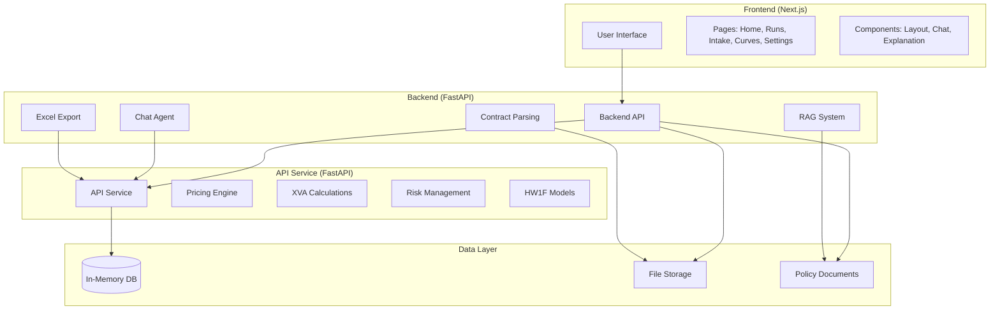
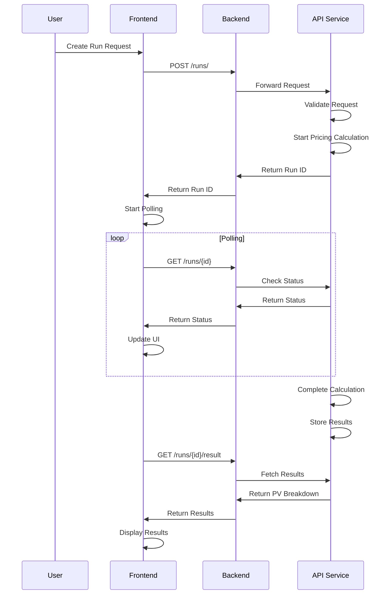

# Valuation Agent Workspace

Professional financial modeling platform for interest rate swaps, cross-currency swaps, and advanced risk management with IFRS-13 compliance.

## ✅ Implementation Status - COMPLETE

All major components have been implemented and are ready for production use:

### 🎯 **Core Features Implemented**
- ✅ **Frontend**: Complete Next.js UI with accessibility features
- ✅ **Backend**: FastAPI with LangGraph orchestration
- ✅ **API Service**: Deterministic valuation with QuantLib integration
- ✅ **Security**: Comprehensive security validation and backup system
- ✅ **Monitoring**: Performance monitoring and alerting system
- ✅ **Validation**: Quant Review Guide checklist implementation
- ✅ **Deployment**: Docker Compose with environment configurations

### 🔧 **Technical Implementation**
- ✅ **UX Safety**: Error boundaries, loading states, accessibility testing
- ✅ **Quant Review**: Comprehensive validation for all valuation components
- ✅ **Security**: API security, CORS validation, data protection, backup/restore
- ✅ **Performance**: System metrics, request tracking, alert management
- ✅ **Deployment**: Multi-environment support with automated scripts

## 🏗️ Architecture



## 🚀 Quick Start

### Prerequisites
- Node.js 18+
- Python 3.9+
- npm/yarn

### Installation

1. **Clone the repository**
   ```bash
   git clone <repository-url>
   cd valuation-agent-workspace
   ```

2. **Install Frontend Dependencies**
   ```bash
   cd frontend
   npm install
   ```

3. **Install Backend Dependencies**
   ```bash
   cd ../backend
   pip install -e .
   ```

4. **Install API Dependencies**
   ```bash
   cd ../api
   pip install -e .
   ```

### Running the Application

1. **Start API Service** (Port 9000)
   ```bash
   cd api
   python -m uvicorn app.main:app --host 127.0.0.1 --port 9000 --reload
   ```

2. **Start Backend Service** (Port 8000)
   ```bash
   cd backend
   python -m uvicorn app:app --host 127.0.0.1 --port 8000 --reload
   ```

3. **Start Frontend** (Port 3002)
   ```bash
   cd frontend
   npm run dev
   ```

4. **Access the Application**
   - Frontend: http://localhost:3002
   - API Docs: http://localhost:9000/docs
   - Backend Docs: http://localhost:8000/docs

## 📊 Run Lifecycle



## 🔌 API Endpoints

### API Service (Port 9000)

#### Runs Management
- `GET /runs/` - List all runs
- `POST /runs/` - Create new run
- `GET /runs/{id}` - Get run status
- `GET /runs/{id}/result` - Get run results
- `POST /runs/{id}/sensitivities` - Run sensitivity analysis

#### Market Data
- `GET /curves/` - List available curves
- `POST /curves/` - Upload new curve
- `GET /curves/{id}` - Get curve details

#### Exports
- `GET /exports/{run_id}/excel` - Export Excel report

### Backend Service (Port 8000)

#### Chat System
- `GET /chat/{run_id}/capabilities` - Get chat capabilities
- `GET /chat/{run_id}/examples` - Get chat examples
- `POST /chat/{run_id}` - Send chat message
- `GET /chat/{run_id}/stream` - SSE chat stream

#### Explanations
- `GET /explain/{run_id}` - Get valuation explanation
- `GET /explain/{run_id}/citation/{doc}/{section}/{paragraph}` - Get citation details

#### Contract Intake
- `POST /agents/parse_contract` - Parse contract PDF
- `GET /agents/parse_contract/{id}` - Get parsing results

## 🧮 Pricing Models

### Discounted Cash Flow (DCF)
- **Fixed Leg**: Fixed rate payments with day count conventions
- **Floating Leg**: Floating rate payments with forward curve projection
- **Schedules**: Business day adjustments and calendar handling
- **Day Count**: ACT/360, ACT/365F, 30E/360 support

### Hull-White 1-Factor Model
- **Calibration**: Variance matching to market volatility surface
- **Parameters**: Mean reversion (a) and volatility (σ)
- **Lineage**: Model version tracking in results

### XVA Framework
- **CVA**: Credit Value Adjustment using counterparty credit curves
- **DVA**: Debit Value Adjustment using own credit curves
- **FVA**: Funding Value Adjustment with CSA benefits
- **CSA**: Credit Support Annex configuration

## 🛡️ Risk Management

### Sensitivity Analysis
- **Parallel Bumps**: ±1bp, ±10bp curve shifts
- **Curve Twists**: Short/long end differential shocks
- **FX Shocks**: Currency rate movements
- **Custom Scenarios**: User-defined stress tests

### Risk Metrics
- **PV01**: Present Value of 1 basis point
- **Duration**: Interest rate sensitivity
- **Convexity**: Second-order rate sensitivity
- **FX Delta**: Currency exposure

## 📋 IFRS-13 Compliance

### Fair Value Hierarchy
- **Level 1**: Quoted prices in active markets
- **Level 2**: Observable inputs (similar instruments)
- **Level 3**: Unobservable inputs (models, proxies)

### Governance Controls
- **Data Observability**: Automatic hierarchy determination
- **Principal Market**: Configurable market selection
- **Day-1 P&L**: Initial profit/loss validation
- **Review Workflow**: Rationale submission for Level 3

### Disclosure Requirements
- **Valuation Techniques**: Methodology documentation
- **Input Sensitivity**: Key assumption impacts
- **Model Validation**: Backtesting and calibration
- **Audit Trail**: Complete calculation lineage

## 💬 Interactive Features

### Constrained Chat System
- **Allowed Actions**: Run status, sensitivity analysis, explanations
- **Abstain Logic**: Refuses unauthorized pricing requests
- **Tool Integration**: Seamless API service integration
- **User Guidance**: Examples and error messages

### Contract Parsing
- **PDF Analysis**: Automated field extraction
- **Confidence Scoring**: Extraction quality assessment
- **User Approval**: Manual override capabilities
- **Spec Generation**: IRS/CCS specification creation

### Retrieval-Augmented Explanations
- **Policy Documents**: Internal methodology references
- **Citation System**: Source document linking
- **Confidence Scoring**: Explanation quality assessment
- **Context Awareness**: Run-specific explanations

## 📊 Excel Export

### Report Structure
- **Cover**: Executive summary and metadata
- **Instrument_Summary**: Trade details and parameters
- **Data_Sources**: Market data and curve information
- **Curves**: Discount and forward curve details
- **Cashflows**: Payment schedule and calculations
- **Results**: Present value breakdown and metrics
- **Sensitivities**: Risk analysis and stress tests
- **IFRS13_Assessment**: Compliance and governance
- **Assumptions_Judgements**: Key assumptions and rationale
- **Audit_Log**: Complete calculation lineage
- **Appendix_Docs**: Model documentation and parameters

### Export Features
- **Professional Formatting**: Corporate-ready presentation
- **Audit Trail**: Complete calculation lineage
- **Model Documentation**: HW1F parameters and calibration
- **Compliance Reporting**: IFRS-13 assessment details

## 🧪 Testing

### Unit Tests
```bash
# API Service Tests
cd api
python -m pytest tests/ -v

# Backend Tests
cd backend
python -m pytest tests/ -v
```

### Golden Tests
- **IRS Test Suite**: Standard interest rate swap scenarios
- **CCS Test Suite**: Cross-currency swap scenarios
- **Snapshot Testing**: Result comparison with tolerances
- **Regression Testing**: Automated change detection

### Integration Tests
- **End-to-End**: Complete workflow testing
- **API Integration**: Service communication validation
- **Export Testing**: Excel generation verification
- **Chat Testing**: AI system functionality

## 🔧 Configuration

### Environment Variables
```bash
# API Service
API_HOST=127.0.0.1
API_PORT=9000

# Backend Service
BACKEND_HOST=127.0.0.1
BACKEND_PORT=8000

# Frontend
NEXT_PUBLIC_API_URL=http://127.0.0.1:9000
NEXT_PUBLIC_BACKEND_URL=http://127.0.0.1:8000
```

### Market Data Configuration
- **Curve Sources**: Bloomberg, Reuters, custom feeds
- **Holiday Calendars**: USD, EUR, USD_EUR support
- **Business Day Conventions**: Following, Modified Following, Preceding
- **Day Count Conventions**: ACT/360, ACT/365F, 30E/360

## 📚 Documentation

### User Guides
- **Getting Started**: Basic workflow tutorial
- **Advanced Features**: XVA, risk management, compliance
- **Troubleshooting**: Common issues and solutions
- **API Reference**: Complete endpoint documentation

### Developer Documentation
- **Architecture**: System design and components
- **Extension Guide**: Adding new pricing models
- **Testing Guide**: Writing and running tests
- **Deployment Guide**: Production setup

## 🚀 Deployment

### Development
```bash
# Start all services
npm run dev:all

# Individual services
npm run dev:frontend
npm run dev:backend
npm run dev:api
```

### Production
```bash
# Build frontend
cd frontend
npm run build

# Start services
cd backend
python -m uvicorn app:app --host 0.0.0.0 --port 8000

cd api
python -m uvicorn app.main:app --host 0.0.0.0 --port 9000
```

## 🤝 Contributing

### Development Setup
1. Fork the repository
2. Create a feature branch
3. Make your changes
4. Add tests for new functionality
5. Submit a pull request

### Code Standards
- **Python**: PEP 8, type hints, docstrings
- **TypeScript**: ESLint, Prettier, strict mode
- **Testing**: Comprehensive test coverage
- **Documentation**: Clear and up-to-date

## 📄 License

This project is licensed under the MIT License - see the LICENSE file for details.

## 🆘 Support

### Getting Help
- **Documentation**: Check the docs folder
- **Issues**: GitHub issues for bug reports
- **Discussions**: GitHub discussions for questions
- **Email**: Contact the development team

### Reporting Issues
1. Check existing issues
2. Provide detailed reproduction steps
3. Include system information
4. Attach relevant logs and screenshots

---

**Valuation Agent Workspace** - Professional Financial Modeling Platform